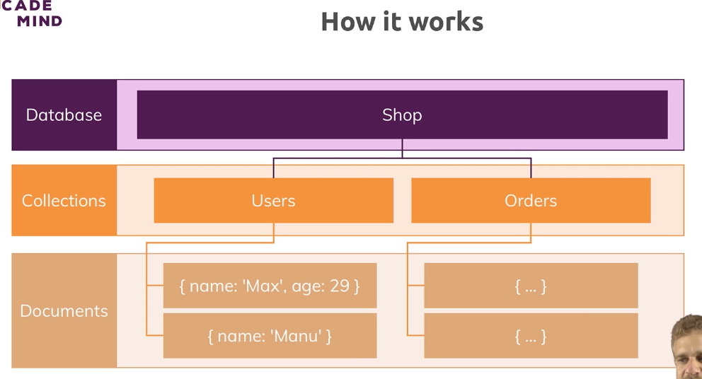

# What is MongoDB?

## How it works

\

- Database -> Shop
  - Collections (similar to `tables` in SQL)
    - Users
      - Documents (simlar to JS objects)
        - {name: 'Max', age: 29}
        - {name: 'Manu'}
    - Orders

MongoDB is Schemaless, which allows for flexibility. You can store totally different data in one collection, and the database can grow with your needs.

### Data is stored in JSON (BSON) Data Format


You can store nested data to create complex relations between data and store them in one document.

MongoDB converts JSON data to a binary version of it (BSON)

---

## Key MongoDB Characteristics

### BSON Data Structure

MongoDB is a "NoSQL" solution. Instead of normalizing data (distributing data across tables and relationships), MongoDB stores data together.


You can always update the database later to grow with your projects.


NoSQL solutions are very popular for read/write applications, as well as the performance and flexibility it gives you.

---

### Understanding the MongoDB Ecosystem

The company behind MongoDB's database is called "MongoDB". They offer products like:

- MongoDB
  - Self managed
  - Enterprise
- CloudManager / OpsManager
- Atlas
- Mobile (MongoDB can be installed on a mobile device)
- Compass (Graphical User Interface) allows you to look at the data
- Data Science Tools
  - BI Connectors
  - MongoDB Charts

- Stitch (Serverless Backend Solution)
  - Serverless Query API
  - Serverless Functions (run JS code in the cloud on demand. Similar to Lambda)
  - Database Triggers
    - Listen to DB events and execute functions in response
  - Real-Time Sync
    - Synchronize data in the cloud with a mobile device


---

## Installing MongoDB

- Create the folder `/data` in your user folder
- Create the subfolder `/data/db` in your `data` folder
- Run the following commands in terminal
  - `brew tap mongodb/brew`
  - `brew install mongodb-community`

- Start the MongoDB server
  - `mongod --dbpath "/users/ryan/data/db"`
  - **You must leave the terminal running while the db server is on**

---

## MongoDB Installation FAQ + Support

**IMPORTANT - For macOS Catalina Users**

If you're on macOS Catalina, there has been a hidden change in the operating system. You're NOT able to use `/data/db` as a database folder anymore. Instead, you have to use a non-root path (e.g. `~/data/db`).

Everything should go smooth when installing MongoDB but in case you're facing any issues, here are a couple of helpful hints + resources that should help you.

**1) Check the Official Docs**

It sounds cheap but the official docs are really good. If you're facing any issues or you're not sure about some step, check the official installation guide for your operating system and make sure you follow the instructions step-by-step.

Windows => https://docs.mongodb.com/manual/tutorial/install-mongodb-on-windows/

macOS => https://docs.mongodb.com/manual/tutorial/install-mongodb-on-os-x/

---

### Use MongoDB

- In the MongoDB console (type `mongo` in a separate terminal window to start)
  - `show dbs`: See existing databases
    - 3 default databases that store metadata (admin, config, local)
  - `use <dbname>`: Create a new database
  - `db.<collection>.insertOne({name: "A Book", price: 12.99})`: Creates a new collection in the database and creates an object
  - `db.<collection>.find()`: Shows all objects in the collection
  - `db.<collection>.find().pretty()`: Shows all objects in the collection in a easier to read format

```
> show dbs
admin   0.000GB
config  0.000GB
local   0.000GB
> use shop
switched to db shop
> db.products.insertOne({name: "A Book", price: 12.99})
{
	"acknowledged" : true,
	"insertedId" : ObjectId("5f4d62676cf99c2b3a0f5be3")
}
> db.products.find()
{ "_id" : ObjectId("5f4d62676cf99c2b3a0f5be3"), "name" : "A Book", "price" : 12.99 }
> 
```

```
> db.products.find().pretty()
{
	"_id" : ObjectId("5f4d62676cf99c2b3a0f5be3"),
	"name" : "A Book",
	"price" : 12.99
}
{
	"_id" : ObjectId("5f4d62bd6cf99c2b3a0f5be4"),
	"name" : "The Shining",
	"price" : 20
}
{
	"_id" : ObjectId("5f4d62f16cf99c2b3a0f5be5"),
	"name" : "Cat in the Hat",
	"price" : 11.99,
	"author" : "Dr. Seuss"
}
```

Create an object with nested data:

```
db.products.insertOne({name: "A Computer", price: 101.99, author: "Dr. Seuss", description: "A high quality computer.", details: {cpu: "Intel i7 9770", memory: 32}})
```

---

## Shell vs. Drivers

- Shell is used as a neutral ground, not tied to a programming language. 
- Drivers are used with a programming language and can be found by going to the [MongoDB Docs Site](https://docs.mongodb.com/drivers/)

---

## Working with MongoDB


- Application: Node.js application
  - Frontend (UI)
  - Backend (Server)
    - Drivers (Queries the MongoDB Server)
      - Node.js
- Data: Database / Storage
  - MongoDB Server
    - Forwards that information to the Storage Engine
  - Storage Engine


Data Layer
- MongoDB Server
- Storage Engine: Loads data into memory, writes data, stores data
- File Server

---

## Course Outline

