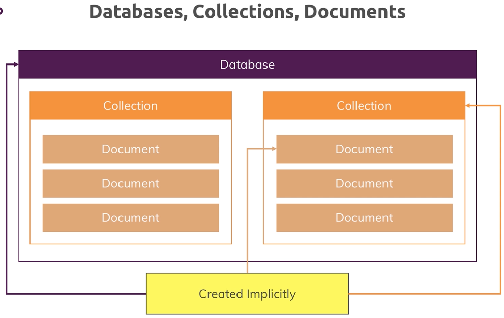
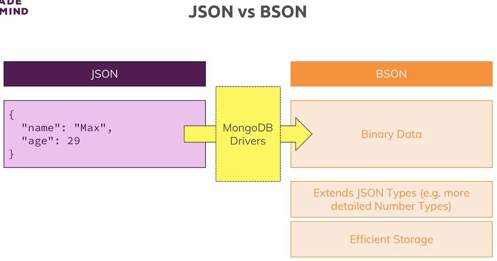
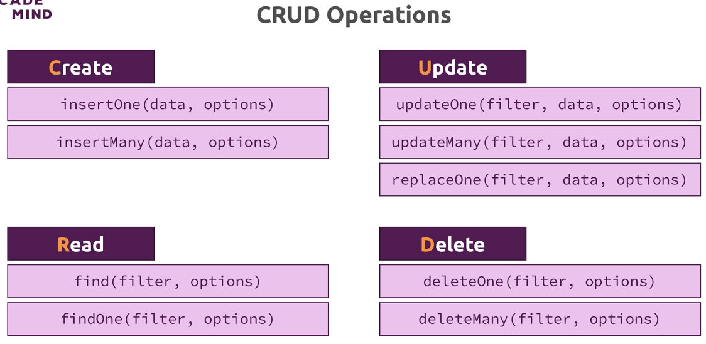
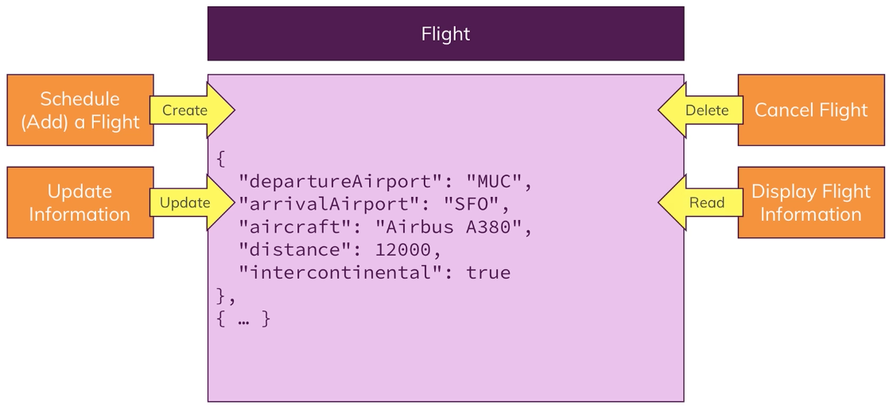
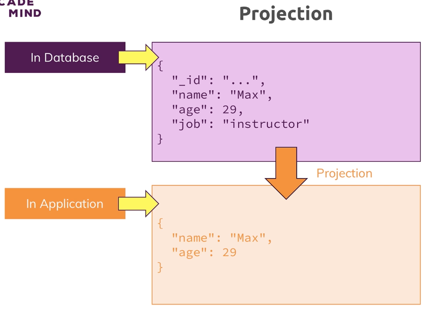
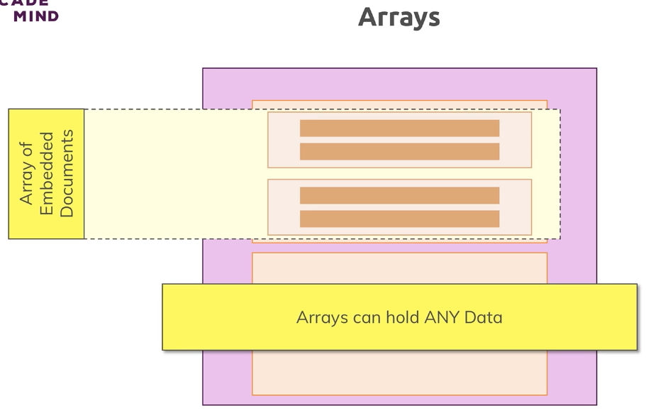

# Understanding the Basics & CRUD Operations


---

## Databases, Colleections & Documents



- **Databases**: You have one or more databases on your server, contains Collections
- **Collections**: (table in SQL) contains Documents
- **Documents**: Data stored in the database

Databases, Collections, Documents are created implicitly when you start creating data

- `mongod --port <portnumber>` allows you to start the MongoDB server on a specific port
- `mongo --port <portnumber>` starts the MongoDB console using the custom port specified (if applicable)

```
> db.flightData.insertOne({"departureAirport": "JFK", "arrivalAirport": "SFO", "aircraft": "Airbus A380", "distance": 600, "intercontinental": false})
{
	"acknowledged" : true,
	"insertedId" : ObjectId("5f4d779ac8e3d390cafa593c")
}
```

```
{
	"_id" : ObjectId("5f4d779ac8e3d390cafa593c"),
	"departureAirport" : "JFK",
	"arrivalAirport" : "SFO",
	"aircraft" : "Airbus A380",
	"distance" : 600,
	"intercontinental" : false
}
```

The `_id` object is a unique ID with timestamp data that allows for searching and sorting.

---

## Comparing JSON and BSON

MongoDB does not use JSON, it uses BSON (Binary JSON)

BSON converts JSON data using the MongoDB drivers. It's faster and more efficient.



- You can create mixed documents in the same collection (schema is different)
- You can also create your own `_id`

```
> db.flightData.insertOne({departureAirport: "TXL", arrivalAirport: "LHR", _id: "txl-lhr-1"})
{ "acknowledged" : true, "insertedId" : "txl-lhr-1" }
```

---

## CRUD Operations & MongoDB


- Application
  - User <-> Code <-> MongoDB Driver
- Analytics / BI Tools
  - BI Connector / Shell
- Admin
  - Shell



- **Create**
  - `insertOne(data, options)`
  - `insertMany(data, options)`
- **Read**
  - `find(filter, options)`
  - `findOne(filter, options)`
- **Update**
  - `updateOne(filter, data, options)`
    - `db.flightData.updateOne({distance: 600}, {$set: {marker: 'delete'}})`
      - The `$` is a reserved operator, `set` means describe the changes you want to make
      - For this document you're finding, please set or add this value
  - `updateMany(filter, data, options)`
  - `replaceOne(filter, data, options)`
- **Delete**
  - `deleteOne(filter, options)`
    - This will delete the first entry that meets the criteria
  - `deleteMany(filter, options)`

### Example #1: Flight Data



---

## Finding, Inserting, Deleting & Updating Elements

`updateOne()`
```
> db.flightData.updateOne({distance: 600}, {$set: {marker: 'delete'}})
{ "acknowledged" : true, "matchedCount" : 1, "modifiedCount" : 1 }
> db.flightData.find().pretty()
{
	"_id" : ObjectId("5f4d779ac8e3d390cafa593c"),
	"departureAirport" : "JFK",
	"arrivalAirport" : "SFO",
	"aircraft" : "Airbus A380",
	"distance" : 600,
	"intercontinental" : false,
	"marker" : "delete"
}
```

`updateMany()`
```
> db.flightData.updateMany({}, {$set: {marker: "toDelete"}})
{ "acknowledged" : true, "matchedCount" : 2, "modifiedCount" : 2 }
> db.flightData.find().pretty()
{
	"_id" : ObjectId("5f4d779ac8e3d390cafa593c"),
	"departureAirport" : "JFK",
	"arrivalAirport" : "SFO",
	"aircraft" : "Airbus A380",
	"distance" : 600,
	"intercontinental" : false,
	"marker" : "toDelete"
}
{
	"_id" : "txl-lhr-1",
	"departureAirport" : "TXL",
	"arrivalAirport" : "LHR",
	"marker" : "toDelete"
}
```

`deleteMany()`
```
> db.flightData.deleteMany({marker: "toDelete"})
{ "acknowledged" : true, "deletedCount" : 2 }
```

`insertMany([])`: Requires an array
```
> db.flightData.insertMany([{departureAirport: "MUC", arrivalAirport: "SFO", aircraft: "Airbus A380", distance: 12000, intercontinental: true}, {departureAirport: "LHR", arrivalAirport: "TXL", aircraft: "Airbus A320", distance: 950, intercontinental: false}])
{
	"acknowledged" : true,
	"insertedIds" : [
		ObjectId("5f4d8796c8e3d390cafa593e"),
		ObjectId("5f4d8796c8e3d390cafa593f")
	]
}
> db.flightData.find().pretty()
{
	"_id" : ObjectId("5f4d8796c8e3d390cafa593e"),
	"departureAirport" : "MUC",
	"arrivalAirport" : "SFO",
	"aircraft" : "Airbus A380",
	"distance" : 12000,
	"intercontinental" : true
}
{
	"_id" : ObjectId("5f4d8796c8e3d390cafa593f"),
	"departureAirport" : "LHR",
	"arrivalAirport" : "TXL",
	"aircraft" : "Airbus A320",
	"distance" : 950,
	"intercontinental" : false
}
```

`find()`
```
> db.flightData.find({distance: 950})
{ "_id" : ObjectId("5f4d8796c8e3d390cafa593f"), "departureAirport" : "LHR", "arrivalAirport" : "TXL", "aircraft" : "Airbus A320", "distance" : 950, "intercontinental" : false }
```

`find()` with parameters (greater than 10,000)
```
> db.flightData.find({distance: {$gt: 10000}})
{ "_id" : ObjectId("5f4d8796c8e3d390cafa593e"), "departureAirport" : "MUC", "arrivalAirport" : "SFO", "aircraft" : "Airbus A380", "distance" : 12000, "intercontinental" : true }
```

`findOne()` with parameters (greater than 10,000)
```
> db.flightData.findOne({distance: {$gt: 10000}})
{
	"_id" : ObjectId("5f4d8796c8e3d390cafa593e"),
	"departureAirport" : "MUC",
	"arrivalAirport" : "SFO",
	"aircraft" : "Airbus A380",
	"distance" : 12000,
	"intercontinental" : true
}
```

`updateOne()` with parameters (`$set` additional document)
```
> db.flightData.updateOne({"_id" : ObjectId("5f4d8796c8e3d390cafa593f")}, {$set: {delayed: true}})
{ "acknowledged" : true, "matchedCount" : 1, "modifiedCount" : 1 }
> db.flightData.find().pretty()
{
	"_id" : ObjectId("5f4d8796c8e3d390cafa593e"),
	"departureAirport" : "MUC",
	"arrivalAirport" : "SFO",
	"aircraft" : "Airbus A380",
	"distance" : 12000,
	"intercontinental" : true
}
{
	"_id" : ObjectId("5f4d8796c8e3d390cafa593f"),
	"departureAirport" : "LHR",
	"arrivalAirport" : "TXL",
	"aircraft" : "Airbus A320",
	"distance" : 950,
	"intercontinental" : false,
	"delayed" : true
}
```

`update()`
```
> db.flightData.update({"_id" : ObjectId("5f4d8796c8e3d390cafa593f")}, {$set: {delayed: true}})
WriteResult({ "nMatched" : 1, "nUpserted" : 0, "nModified" : 0 })
> db.flightData.update({"_id" : ObjectId("5f4d8796c8e3d390cafa593f")}, {$set: {delayed: false}})
WriteResult({ "nMatched" : 1, "nUpserted" : 0, "nModified" : 1 })
```

`update()` vs `updateMany()` / `updateOne()`

`updateMany` and `updateOne` require operators when making changes, whereas `update` will overwrite the record with whatever documents are set:

```
> db.flightData.update({"_id" : ObjectId("5f4d8796c8e3d390cafa593f")}, {delayed: false})
WriteResult({ "nMatched" : 1, "nUpserted" : 0, "nModified" : 1 })
> db.flightData.updateOne({"_id" : ObjectId("5f4d8796c8e3d390cafa593f")}, {delayed: false})
uncaught exception: Error: the update operation document must contain atomic operators :
DBCollection.prototype.updateOne@src/mongo/shell/crud_api.js:565:19
@(shell):1:1
```

```
> db.flightData.find().pretty()
{
	"_id" : ObjectId("5f4d8796c8e3d390cafa593e"),
	"departureAirport" : "MUC",
	"arrivalAirport" : "SFO",
	"aircraft" : "Airbus A380",
	"distance" : 12000,
	"intercontinental" : true
}
{ "_id" : ObjectId("5f4d8796c8e3d390cafa593f"), "delayed" : false }
```

---

## Find

`find()` does not return all documents in a collection, instead it gives us a `cursor` object (returns first 20 items) that provides metadata that allows us to cycle through results (using `it`).

```
> db.passengers.find().pretty()
{
	"_id" : ObjectId("5f4e589fc8e3d390cafa5940"),
	"name" : "Max Schwarzmueller",
	"age" : 29
}
{
	"_id" : ObjectId("5f4e589fc8e3d390cafa5941"),
	"name" : "Manu Lorenz",
	"age" : 30
}
{
	"_id" : ObjectId("5f4e589fc8e3d390cafa5942"),
	"name" : "Chris Hayton",
	"age" : 35
}
{
	"_id" : ObjectId("5f4e589fc8e3d390cafa5943"),
	"name" : "Sandeep Kumar",
	"age" : 28
}
{
	"_id" : ObjectId("5f4e589fc8e3d390cafa5944"),
	"name" : "Maria Jones",
	"age" : 30
}
{
	"_id" : ObjectId("5f4e589fc8e3d390cafa5945"),
	"name" : "Alexandra Maier",
	"age" : 27
}
{
	"_id" : ObjectId("5f4e589fc8e3d390cafa5946"),
	"name" : "Dr. Phil Evans",
	"age" : 47
}
{
	"_id" : ObjectId("5f4e589fc8e3d390cafa5947"),
	"name" : "Sandra Brugge",
	"age" : 33
}
{
	"_id" : ObjectId("5f4e589fc8e3d390cafa5948"),
	"name" : "Elisabeth Mayr",
	"age" : 29
}
{
	"_id" : ObjectId("5f4e589fc8e3d390cafa5949"),
	"name" : "Frank Cube",
	"age" : 41
}
{
	"_id" : ObjectId("5f4e589fc8e3d390cafa594a"),
	"name" : "Karandeep Alun",
	"age" : 48
}
{
	"_id" : ObjectId("5f4e589fc8e3d390cafa594b"),
	"name" : "Michaela Drayer",
	"age" : 39
}
{
	"_id" : ObjectId("5f4e589fc8e3d390cafa594c"),
	"name" : "Bernd Hoftstadt",
	"age" : 22
}
{
	"_id" : ObjectId("5f4e589fc8e3d390cafa594d"),
	"name" : "Scott Tolib",
	"age" : 44
}
{
	"_id" : ObjectId("5f4e589fc8e3d390cafa594e"),
	"name" : "Freddy Melver",
	"age" : 41
}
{
	"_id" : ObjectId("5f4e589fc8e3d390cafa594f"),
	"name" : "Alexis Bohed",
	"age" : 35
}
{
	"_id" : ObjectId("5f4e589fc8e3d390cafa5950"),
	"name" : "Melanie Palace",
	"age" : 27
}
{
	"_id" : ObjectId("5f4e589fc8e3d390cafa5951"),
	"name" : "Armin Glutch",
	"age" : 35
}
{
	"_id" : ObjectId("5f4e589fc8e3d390cafa5952"),
	"name" : "Klaus Arber",
	"age" : 53
}
{
	"_id" : ObjectId("5f4e589fc8e3d390cafa5953"),
	"name" : "Albert Twostone",
	"age" : 68
}
Type "it" for more
> it
{
	"_id" : ObjectId("5f4e589fc8e3d390cafa5954"),
	"name" : "Gordon Black",
	"age" : 38
}
```

`find().toArray()` will return all objects in the array

```
> db.passengers.find().toArray()
[
	{
		"_id" : ObjectId("5f4e589fc8e3d390cafa5940"),
		"name" : "Max Schwarzmueller",
		"age" : 29
	},
	{
		"_id" : ObjectId("5f4e589fc8e3d390cafa5941"),
		"name" : "Manu Lorenz",
		"age" : 30
	},
	{
		"_id" : ObjectId("5f4e589fc8e3d390cafa5942"),
		"name" : "Chris Hayton",
		"age" : 35
	},
	{
		"_id" : ObjectId("5f4e589fc8e3d390cafa5943"),
		"name" : "Sandeep Kumar",
		"age" : 28
	},
	{
		"_id" : ObjectId("5f4e589fc8e3d390cafa5944"),
		"name" : "Maria Jones",
		"age" : 30
	},
	{
		"_id" : ObjectId("5f4e589fc8e3d390cafa5945"),
		"name" : "Alexandra Maier",
		"age" : 27
	},
	{
		"_id" : ObjectId("5f4e589fc8e3d390cafa5946"),
		"name" : "Dr. Phil Evans",
		"age" : 47
	},
	{
		"_id" : ObjectId("5f4e589fc8e3d390cafa5947"),
		"name" : "Sandra Brugge",
		"age" : 33
	},
	{
		"_id" : ObjectId("5f4e589fc8e3d390cafa5948"),
		"name" : "Elisabeth Mayr",
		"age" : 29
	},
	{
		"_id" : ObjectId("5f4e589fc8e3d390cafa5949"),
		"name" : "Frank Cube",
		"age" : 41
	},
	{
		"_id" : ObjectId("5f4e589fc8e3d390cafa594a"),
		"name" : "Karandeep Alun",
		"age" : 48
	},
	{
		"_id" : ObjectId("5f4e589fc8e3d390cafa594b"),
		"name" : "Michaela Drayer",
		"age" : 39
	},
	{
		"_id" : ObjectId("5f4e589fc8e3d390cafa594c"),
		"name" : "Bernd Hoftstadt",
		"age" : 22
	},
	{
		"_id" : ObjectId("5f4e589fc8e3d390cafa594d"),
		"name" : "Scott Tolib",
		"age" : 44
	},
	{
		"_id" : ObjectId("5f4e589fc8e3d390cafa594e"),
		"name" : "Freddy Melver",
		"age" : 41
	},
	{
		"_id" : ObjectId("5f4e589fc8e3d390cafa594f"),
		"name" : "Alexis Bohed",
		"age" : 35
	},
	{
		"_id" : ObjectId("5f4e589fc8e3d390cafa5950"),
		"name" : "Melanie Palace",
		"age" : 27
	},
	{
		"_id" : ObjectId("5f4e589fc8e3d390cafa5951"),
		"name" : "Armin Glutch",
		"age" : 35
	},
	{
		"_id" : ObjectId("5f4e589fc8e3d390cafa5952"),
		"name" : "Klaus Arber",
		"age" : 53
	},
	{
		"_id" : ObjectId("5f4e589fc8e3d390cafa5953"),
		"name" : "Albert Twostone",
		"age" : 68
	},
	{
		"_id" : ObjectId("5f4e589fc8e3d390cafa5954"),
		"name" : "Gordon Black",
		"age" : 38
	}
]
```

`find().forEach()` allows us to perform an action on each element

```
> db.passengers.find().forEach((passengerData) => {printjson(passengerData)})
{
	"_id" : ObjectId("5f4e589fc8e3d390cafa5940"),
	"name" : "Max Schwarzmueller",
	"age" : 29
}
{
	"_id" : ObjectId("5f4e589fc8e3d390cafa5941"),
	"name" : "Manu Lorenz",
	"age" : 30
}
{
	"_id" : ObjectId("5f4e589fc8e3d390cafa5942"),
	"name" : "Chris Hayton",
	"age" : 35
}
{
	"_id" : ObjectId("5f4e589fc8e3d390cafa5943"),
	"name" : "Sandeep Kumar",
	"age" : 28
}
{
	"_id" : ObjectId("5f4e589fc8e3d390cafa5944"),
	"name" : "Maria Jones",
	"age" : 30
}
{
	"_id" : ObjectId("5f4e589fc8e3d390cafa5945"),
	"name" : "Alexandra Maier",
	"age" : 27
}
{
	"_id" : ObjectId("5f4e589fc8e3d390cafa5946"),
	"name" : "Dr. Phil Evans",
	"age" : 47
}
{
	"_id" : ObjectId("5f4e589fc8e3d390cafa5947"),
	"name" : "Sandra Brugge",
	"age" : 33
}
{
	"_id" : ObjectId("5f4e589fc8e3d390cafa5948"),
	"name" : "Elisabeth Mayr",
	"age" : 29
}
{
	"_id" : ObjectId("5f4e589fc8e3d390cafa5949"),
	"name" : "Frank Cube",
	"age" : 41
}
{
	"_id" : ObjectId("5f4e589fc8e3d390cafa594a"),
	"name" : "Karandeep Alun",
	"age" : 48
}
{
	"_id" : ObjectId("5f4e589fc8e3d390cafa594b"),
	"name" : "Michaela Drayer",
	"age" : 39
}
{
	"_id" : ObjectId("5f4e589fc8e3d390cafa594c"),
	"name" : "Bernd Hoftstadt",
	"age" : 22
}
{
	"_id" : ObjectId("5f4e589fc8e3d390cafa594d"),
	"name" : "Scott Tolib",
	"age" : 44
}
{
	"_id" : ObjectId("5f4e589fc8e3d390cafa594e"),
	"name" : "Freddy Melver",
	"age" : 41
}
{
	"_id" : ObjectId("5f4e589fc8e3d390cafa594f"),
	"name" : "Alexis Bohed",
	"age" : 35
}
{
	"_id" : ObjectId("5f4e589fc8e3d390cafa5950"),
	"name" : "Melanie Palace",
	"age" : 27
}
{
	"_id" : ObjectId("5f4e589fc8e3d390cafa5951"),
	"name" : "Armin Glutch",
	"age" : 35
}
{
	"_id" : ObjectId("5f4e589fc8e3d390cafa5952"),
	"name" : "Klaus Arber",
	"age" : 53
}
{
	"_id" : ObjectId("5f4e589fc8e3d390cafa5953"),
	"name" : "Albert Twostone",
	"age" : 68
}
{
	"_id" : ObjectId("5f4e589fc8e3d390cafa5954"),
	"name" : "Gordon Black",
	"age" : 38
}
```

---

## Understanding Projection



- Projection: 

`find({}, {name: 1})` finds all documents in a collection, and specifies the field we want to include (indicated by the `1`)

```
> db.passengers.find({}, {name: 1}).pretty()
{
	"_id" : ObjectId("5f4e589fc8e3d390cafa5940"),
	"name" : "Max Schwarzmueller"
}
{ "_id" : ObjectId("5f4e589fc8e3d390cafa5941"), "name" : "Manu Lorenz" }
{ "_id" : ObjectId("5f4e589fc8e3d390cafa5942"), "name" : "Chris Hayton" }
{ "_id" : ObjectId("5f4e589fc8e3d390cafa5943"), "name" : "Sandeep Kumar" }
{ "_id" : ObjectId("5f4e589fc8e3d390cafa5944"), "name" : "Maria Jones" }
{ "_id" : ObjectId("5f4e589fc8e3d390cafa5945"), "name" : "Alexandra Maier" }
{ "_id" : ObjectId("5f4e589fc8e3d390cafa5946"), "name" : "Dr. Phil Evans" }
{ "_id" : ObjectId("5f4e589fc8e3d390cafa5947"), "name" : "Sandra Brugge" }
{ "_id" : ObjectId("5f4e589fc8e3d390cafa5948"), "name" : "Elisabeth Mayr" }
{ "_id" : ObjectId("5f4e589fc8e3d390cafa5949"), "name" : "Frank Cube" }
{ "_id" : ObjectId("5f4e589fc8e3d390cafa594a"), "name" : "Karandeep Alun" }
{ "_id" : ObjectId("5f4e589fc8e3d390cafa594b"), "name" : "Michaela Drayer" }
{ "_id" : ObjectId("5f4e589fc8e3d390cafa594c"), "name" : "Bernd Hoftstadt" }
{ "_id" : ObjectId("5f4e589fc8e3d390cafa594d"), "name" : "Scott Tolib" }
{ "_id" : ObjectId("5f4e589fc8e3d390cafa594e"), "name" : "Freddy Melver" }
{ "_id" : ObjectId("5f4e589fc8e3d390cafa594f"), "name" : "Alexis Bohed" }
{ "_id" : ObjectId("5f4e589fc8e3d390cafa5950"), "name" : "Melanie Palace" }
{ "_id" : ObjectId("5f4e589fc8e3d390cafa5951"), "name" : "Armin Glutch" }
{ "_id" : ObjectId("5f4e589fc8e3d390cafa5952"), "name" : "Klaus Arber" }
{ "_id" : ObjectId("5f4e589fc8e3d390cafa5953"), "name" : "Albert Twostone" }
```

`find({}, {name: 1, _id: 0})` indicates we are including the `name` field (indicated by the `1`) and excluding the `_id` field (indicated by the `0`)

```
> db.passengers.find({}, {name: 1, _id: 0}).pretty()
{ "name" : "Max Schwarzmueller" }
{ "name" : "Manu Lorenz" }
{ "name" : "Chris Hayton" }
{ "name" : "Sandeep Kumar" }
{ "name" : "Maria Jones" }
{ "name" : "Alexandra Maier" }
{ "name" : "Dr. Phil Evans" }
{ "name" : "Sandra Brugge" }
{ "name" : "Elisabeth Mayr" }
{ "name" : "Frank Cube" }
{ "name" : "Karandeep Alun" }
{ "name" : "Michaela Drayer" }
{ "name" : "Bernd Hoftstadt" }
{ "name" : "Scott Tolib" }
{ "name" : "Freddy Melver" }
{ "name" : "Alexis Bohed" }
{ "name" : "Melanie Palace" }
{ "name" : "Armin Glutch" }
{ "name" : "Klaus Arber" }
{ "name" : "Albert Twostone" }
```

---

## Embedded Documents

Core feature of MongoDB


You can have a field in a document that includes another sub-document



---

## Working with Embedded Documents

Embedded Document: Another JSON document within a wrapping JSON document. Each document has a child document.

```
> db.flightData.updateMany({}, {$set: {status: {description: "on-time", lastUpdated: "1 hour ago"}}})

> db.flightData.find().pretty()
{
	"_id" : ObjectId("5f4d8796c8e3d390cafa593e"),
	"departureAirport" : "LHR",
	"arrivalAirport" : "TXL",
	"aircraft" : "Airbus A320",
	"distance" : 950,
	"intercontinental" : false,
	"delayed" : true,
	"status" : {
		"description" : "on-time",
		"lastUpdated" : "1 hour ago"
	}
}
{
	"_id" : ObjectId("5f4d8796c8e3d390cafa593f"),
	"departureAirport" : "LHR",
	"arrivalAirport" : "TXL",
	"aircraft" : "Airbus A320",
	"distance" : 950,
	"intercontinental" : false,
	"delayed" : true,
	"status" : {
		"description" : "on-time",
		"lastUpdated" : "1 hour ago"
	}
}
```

Adding an embedded document within another embedded document:

```
> db.flightData.updateMany({}, {$set: {status: {description: "on-time", lastUpdated: "1 hour ago", details: {responsible: "Ryan Seit"}}}})
{ "acknowledged" : true, "matchedCount" : 2, "modifiedCount" : 2 }
> db.flightData.find().pretty()
{
	"_id" : ObjectId("5f4d8796c8e3d390cafa593e"),
	"departureAirport" : "LHR",
	"arrivalAirport" : "TXL",
	"aircraft" : "Airbus A320",
	"distance" : 950,
	"intercontinental" : false,
	"delayed" : true,
	"status" : {
		"description" : "on-time",
		"lastUpdated" : "1 hour ago",
		"details" : {
			"responsible" : "Ryan Seit"
		}
	}
}
{
	"_id" : ObjectId("5f4d8796c8e3d390cafa593f"),
	"departureAirport" : "LHR",
	"arrivalAirport" : "TXL",
	"aircraft" : "Airbus A320",
	"distance" : 950,
	"intercontinental" : false,
	"delayed" : true,
	"status" : {
		"description" : "on-time",
		"lastUpdated" : "1 hour ago",
		"details" : {
			"responsible" : "Ryan Seit"
		}
	}
}
```

---

## Working with Arrays

You can have documents in arrays and arrays in documents.

```
> db.passengers.updateOne({name: "Albert Twostone"}, {$set: {hobbies: ["sports", "cooking"]}})
{ "acknowledged" : true, "matchedCount" : 1, "modifiedCount" : 1 }

> db.passengers.find({name: "Albert Twostone"}).pretty()
{
	"_id" : ObjectId("5f4e589fc8e3d390cafa5953"),
	"name" : "Albert Twostone",
	"age" : 68,
	"hobbies" : [
		"sports",
		"cooking"
	]
}
```

---

## Accessing Structured Data

```
> db.passengers.findOne({name: "Albert Twostone"}).hobbies
[ "sports", "cooking" ]
```

```
> db.passengers.find({hobbies: "sports"}).pretty()
{
	"_id" : ObjectId("5f4e589fc8e3d390cafa5953"),
	"name" : "Albert Twostone",
	"age" : 68,
	"hobbies" : [
		"sports",
		"cooking"
	]
}
```

When using dot-notation, you must enclose the path in quotes:

```
> db.flightData.find({"status.description": "on-time"}).pretty()
{
	"_id" : ObjectId("5f4d8796c8e3d390cafa593e"),
	"departureAirport" : "LHR",
	"arrivalAirport" : "TXL",
	"aircraft" : "Airbus A320",
	"distance" : 950,
	"intercontinental" : false,
	"delayed" : true,
	"status" : {
		"description" : "on-time",
		"lastUpdated" : "1 hour ago",
		"details" : {
			"responsible" : "Ryan Seit"
		}
	}
}
{
	"_id" : ObjectId("5f4d8796c8e3d390cafa593f"),
	"departureAirport" : "LHR",
	"arrivalAirport" : "TXL",
	"aircraft" : "Airbus A320",
	"distance" : 950,
	"intercontinental" : false,
	"delayed" : true,
	"status" : {
		"description" : "on-time",
		"lastUpdated" : "1 hour ago",
		"details" : {
			"responsible" : "Ryan Seit"
		}
	}
}
```

```
> db.flightData.find({"status.details.responsible": "Ryan Seit"}).pretty()
{
	"_id" : ObjectId("5f4d8796c8e3d390cafa593e"),
	"departureAirport" : "LHR",
	"arrivalAirport" : "TXL",
	"aircraft" : "Airbus A320",
	"distance" : 950,
	"intercontinental" : false,
	"delayed" : true,
	"status" : {
		"description" : "on-time",
		"lastUpdated" : "1 hour ago",
		"details" : {
			"responsible" : "Ryan Seit"
		}
	}
}
{
	"_id" : ObjectId("5f4d8796c8e3d390cafa593f"),
	"departureAirport" : "LHR",
	"arrivalAirport" : "TXL",
	"aircraft" : "Airbus A320",
	"distance" : 950,
	"intercontinental" : false,
	"delayed" : true,
	"status" : {
		"description" : "on-time",
		"lastUpdated" : "1 hour ago",
		"details" : {
			"responsible" : "Ryan Seit"
		}
	}
}
```

---

## Assignment 1: The Basics & CRUD Operations

1. Insert 3 patient records (one nested document) with at least 1 history entry per patient
   
   ```
   > db.patients.insertOne({firstName: "Ryan", lastName: "Seit", age: 38, history: [{disease: "cold", treatment: "antibiotics"}]})
   
   > db.patients.insertOne({firstName: "Gina", lastName: "Shaffer", age: 35, history: [{disease: "thyroiditis", treatment: "synthroid"}]})
   
   > db.patients.insertOne({firstName: "Nick", lastName: "Shaffer", age: 38, history: [{disease: "cold", treatment: "antibiotics"}]})
   ```
   
2. Update patient data of 1 patient with new age, name and history entry

  ```
  > db.patients.updateOne({firstName: "Gina"}, {$set: {lastName: "Seit", age: 34, history: [{disease: "flu", treatment: "zinc"}]}})

  {
    "_id" : ObjectId("5f4e6007c8e3d390cafa5956"),
    "firstName" : "Gina",
    "lastName" : "Seit",
    "age" : 34,
    "history" : [{
      "disease" : "flu",
      "treatment" : "zinc"
    }]
  }
  ```

3. Find all patients who are older than 30 (or a value of your choice)

  ```
  db.patients.find({age: {$gt: 35}})

  { "_id" : ObjectId("5f4e5fd6c8e3d390cafa5955"), "firstName" : "Ryan", "lastName" : "Seit", "age" : 38, "history" : [ { "disease" : "cold", "treatment" : "antibiotics" } ] }

  { "_id" : ObjectId("5f4e6018c8e3d390cafa5957"), "firstName" : "Nick", "lastName" : "Shaffer", "age" : 38, "history" : [ { "disease" : "cold", "treatment" : "antibiotics" } ] }
  ```

4. Delete all patients who got a cold as a disease

  ```
  > db.patients.deleteMany({"history.disease": "cold"})
  { "acknowledged" : true, "deletedCount" : 2 }

  > db.patients.find().pretty()
  {
    "_id" : ObjectId("5f4e6007c8e3d390cafa5956"),
    "firstName" : "Gina",
    "lastName" : "Seit",
    "age" : 34,
    "history" : [{
		  "disease" : "flu",
		  "treatment" : "zinc"
    }]
  }
  ```
